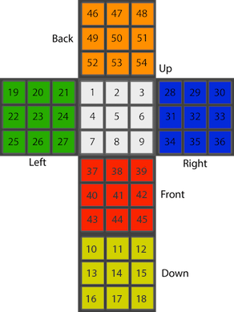

# Rubik's Cube Solver
###### Prolog solution for solving a 3x3x3 Rubik's Cube

#### Authors
* Trent Rand <<contact@Trentrand.com>>
* Robert Dinaro

#### Cube Map Guide
```
Colors: (W)hite, (Y)ellow,  (G)reen,  (B)lue,  (R)ed,   (O)range
Sides : (U)p,    (D)own,    (L)eft,   (R)ight, (F)ront, (B)ack
```

The cube is mapped in the following structure, where variables are listed in numerical order presented in the visual representation below:
```
   Side Labels:    UUUUUUUUU DDDDDDDDD LLLLLLLLL RRRRRRRRR FFFFFFFFF BBBBBBBBB
   Color Labels:   WWWWWWWWW YYYYYYYYY GGGGGGGGG BBBBBBBBB RRRRRRRRR OOOOOOOOO
                                         ^ variables listed in numerical order
```
1. The cube should be held so the top middle cube (U5/W5) is white.
2. The side that is facing you should have a red cube in the middle (F5/R5).
3. The side on the right of your orientation should have a blue cube in the middle.

#### Visual representation of cube map
   

#### Usage
   With your cube in the correct orientation, as explained in the   documentation, input your cube map to generate a solution.

   Input each face in the order specfied above by the 'Order of   Input' representation above.

   For example, the following is how you can solve a solved cube with F,R,U applied:
   ```
   | :- [rubiks].
   | :- solve(Solution, cube(g,w,w,g,w,w,r,r,r,b,b,o,y,y,o,y,y,o,g,g,r,g,g,r,y,y,b,o,b,b,o,b,b,g,b,b,w,w,w,r,r,y,r,r,y,o,o,w,o,o,w,y,g,g), C), solved(C).
   ```

#### Test case
   The following is a cube map for a solved cube with the Left side rotated 90 degrees:

   `cube(o,w,w,o,w,w,o,w,w, r,y,y,r,y,y,r,y,y, g,g,g,g,g,g,g,g,g, b,b,b,b,b,b,b,b,b, w,r,r,w,r,r,w,r,r, y,o,o,y,o,o,y,o,o)`

   To solve, it should require 3 rotations of Left side, with a solution of [left,left,left].

   `| ?- solve(Solution, cube(o,w,w,o,w,w,o,w,w, r,y,y,r,y,y,r,y,y, g,g,g,g,g,g,g,g,g, b,b,b,b,b,b,b,b,b, w,r,r,w,r,r,w,r,r, y,o,o,y,o,o,y,o,o), C), solved(C).`


   `Solution = [left, left, left]`

#### More information
   Please see the [presentation](Presentation.key) for more information.
